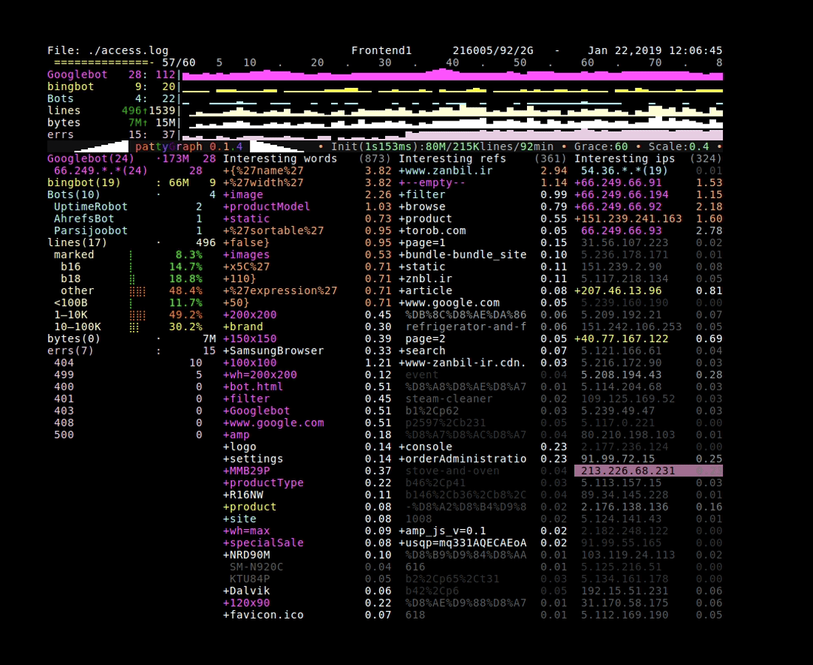
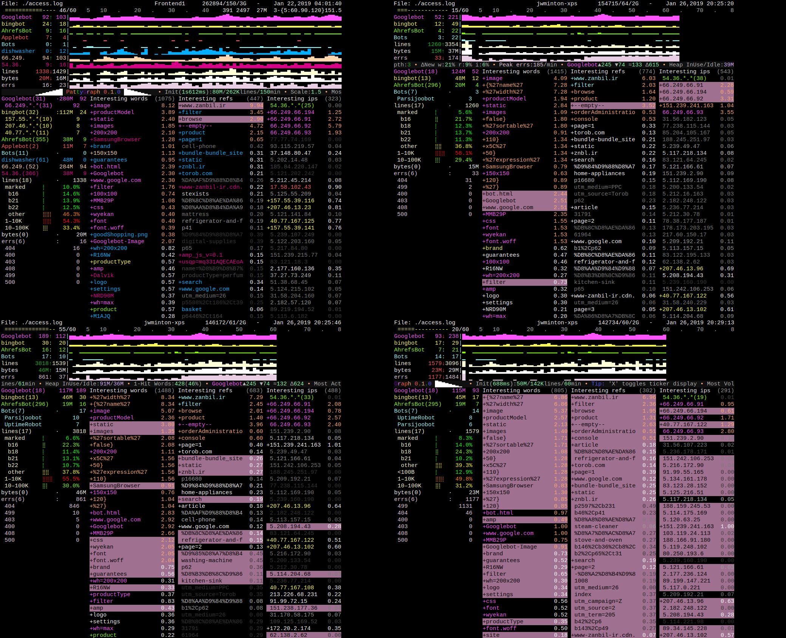
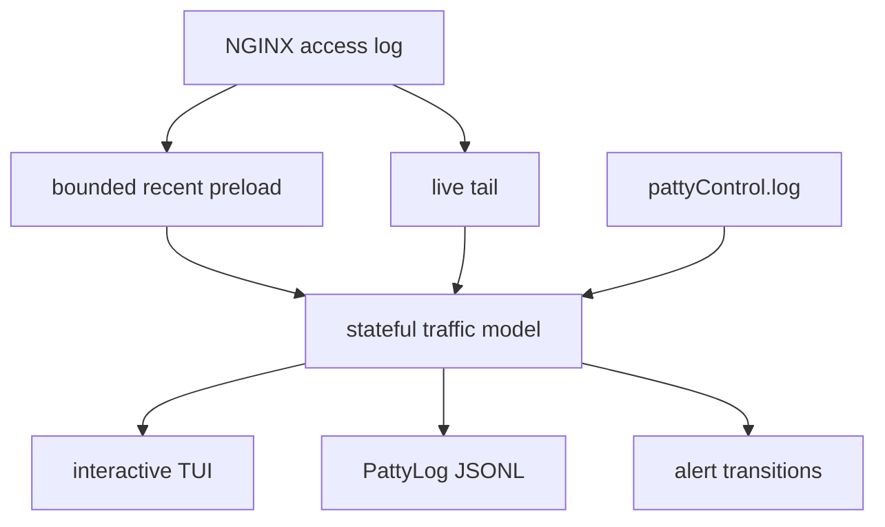

# PattyGraph

## See the traffic shape before you search the traffic.

Raw access logs explain a site one request at a time. PattyGraph shows what the traffic is becoming: which bot or source
is winning, which paths and referrers are rising, where errors are clustering, and which patterns deserve a closer look.

PattyGraph is a live NGINX access-log instrument for the operational space between `tail -f` and a full ingestion stack.
It builds a compact, stateful view directly from the log already on disk, presents that view in an interactive TUI, and
publishes the same running model as structured PattyLog JSONL for scripts, automation, and AI agents.

**Agentic operation** is expected with built-in control surfaces and guidance documented by the binary itself:
```bash
./pattyGraph --help ai
```
The embedded guide shows an agent how to join a `tmux` session, read PattyLog, issue matcher, selection, alert, and
configuration commands, save evidence, and verify the results through the same shared traffic model used by human
operators.



**Jump to:** [Run it](#run-it) ·
[Read the screen](#what-the-screen-is-showing) ·
[Architecture](#the-architecture-behind-the-view) ·
[Configuration](#configuration-is-a-replayable-command-stream) ·
[Documentation](#documentation-by-question)

## A Different First View Of Access Logs

PattyGraph turns a live log stream into operational evidence before anyone has
to read the firehose.

"Instant on" also changes the tempo of investigation. On an ordinary development
machine, PattyGraph can preload and summarize roughly 200,000 recent log lines in
about a second before live tailing takes over. That startup speed
practically eliminates the hesitation to take a look.

It continuously answers questions such as:

- Which traffic class is dominating this interval?
- Is bot-like traffic concentrated in one identity, one prefix, or many sources?
- Are errors moving with a bot, an IP group, or a request path?
- Did byte volume rise without a matching rise in request volume?
- Which words, referrers, and IPs explain the current traffic shape?
- Which retained source line best represents the pattern on screen?
- What changed after an operator or agent added a matcher or alert?

The raw log remains the source of truth. PattyGraph makes it practical to decide
where the next `rg`, `grep`, `awk`, or forensic query should begin.

## Run It

PattyGraph defaults to `./access.log` when no path is supplied.

```bash
go build -o pattyGraph .
./pattyGraph /var/log/nginx/access.log
```

For a stable machine-readable sidecar and control file under one directory:

```bash
mkdir -p ./splats

./pattyGraph \
  --save-dir ./splats \
  --json-file pattyLog.jsonl \
  --control-file pattyControl.log \
  /var/log/nginx/access.log
```

Prebuilt Linux binaries are available from the
[v0.1.6 release](https://github.com/jwminton/pattyGraph/releases/tag/v0.1.6).

Useful built-in references:

```bash
./pattyGraph --help
./pattyGraph --help layout
./pattyGraph --help inline
./pattyGraph --help jsonl
./pattyGraph --help ai
./pattyGraph --help facts
```

Inside the TUI, `Ctrl-H` opens a compact reminder for keyboard and mouse
controls.

## What The Screen Is Showing

The upper area is an ordered set of live matcher and system lanes. Each lane has
current activity, recent movement, and up to an 80-interval sparkline history.

```text
promoted bot / IP / custom matcher lanes
Bots
lines
bytes
errs
selected interesting-item history
```

The lower area explains those lanes:

```text
matcher detail | interesting words | referrers | IPs and prefix groups
```

Rows above `Bots` compete to claim a line for the bot-centric view. `Bots` is
the broad fallback for unclaimed bot-like traffic. Rows below that boundary
observe every parsed line and collect system totals, errors, request texture,
referrers, IPs, and grouped source context.

Selections connect the summary back to evidence. Click a matcher, sparkline
interval, word, referrer, IP, or prefix group to expose retained history and a
representative source line. `Tab` cycles the secondary lens through burstiness,
recent flux, history depth, User-Agent movement, mini-sparklines, and bytes.

See [Click Zones](docs/CLICK_ZONES.md),
[Tab View Cycles](docs/TAB_VIEW_CYCLES.md), and
[Selection Deep Dive](docs/SELECTION_DEEP_DIVE.md) for the full interaction
model.

## Read Traffic Shape, Not Just Totals



The same error count can describe very different incidents. PattyGraph keeps
enough surrounding shape visible to distinguish patterns such as:

| Screen shape | First interpretation |
| --- | --- |
| Scattered errors with no persistent source | Ordinary background failures or startup noise |
| Errors moving with recurring IPs or prefixes | Client-driven probing, automation, or a concentrated source problem |
| Errors moving with request words across many clients | Content, routing, or deployment behavior |
| Broad errors rising with total traffic | A systemic service or dependency failure |

These are investigation cues, not automated verdicts. The screen tells an
operator which evidence should be inspected next.


## One Live Model, Three Operating Surfaces

The TUI, PattyLog, and control file are different surfaces over one running
traffic model.



### Human surface: the TUI

Watch traffic move, compare lanes, inspect source shape, select retained
evidence, and tune the session without leaving the terminal.

### Machine surface: PattyLog JSONL

PattyLog writes schema-versioned `session_start`, `interval`,
`control_command`, and `alert` records. It carries matcher state, ranked
interesting keys, IP groups, selected context, factoids, and alert transitions
without reproducing the raw log.

### Control surface: inline commands

Configuration files, control-file input, and `!!!` lines injected into a
watched log all use the same command language.

```text
!!! add bad-paths .php wslogin xmlrpc
!!! add --ips checkout-sources 203.0.113.
!!! alert errs above 50
!!! add health /healthz
!!! alert health below 1       # Missing health checks?
!!! select --ips 203.0.113.
!!! dumpConfig
```

With PattyLog enabled, control attempts and their structured results become part
of the session record. A human, script, or agent can observe, act, and verify
through the same local process.

Read [PattyLog Schema Guide](docs/PATTYLOG_SCHEMA.md),
[PattyLog Live Shape](docs/JSONL_DIAGRAM.md), and
[Selection Markup and Context](docs/SELECTION_MARKUP.md) for the machine-facing
contract.

## The Architecture Behind The View

PattyGraph is specialized rather than generic. Its internal architecture is
shaped around sustained, line-rate observation of NGINX traffic.

### Log lines behave like one-way requests

Internally, PattyGraph is organized like a server whose requests are access-log
lines. Each line is parsed once, passed through the running model, and allowed
to update matchers, counters, retained keys, source examples, alerts, and
history. There is no per-line response. The TUI and JSONL stream are
asynchronous projections of accumulated state.

That model keeps the hot path direct while several consumers share one coherent
interpretation of the traffic.

### The matcher list is a forward-only stack of sieves

Every parsed line moves downward through an ordered pipeline. A stage may claim
the line, attach matcher identity and color, remember an IP, or add observational
context. Lower stages do not reach upward and revise earlier decisions.

The `Bots` row is the visible boundary:

```text
above Bots: first-claim competition
Bots:       broad bot-like fallback
below Bots: shared observation
```

This ordering powers bot promotion, remembered-IP association, custom matcher
placement, shared historical scaling, and the visible row layout. See
[Matcher Pipeline and Bots Competition](docs/MATCHER_PIPELINE_BOTS_COMPETITION.md)
and [Bot and Bot-Army Detection](docs/BOT_ARMY_DETECTION.md).

### Interesting entries live under time pressure

Every retained word, referrer, and IP has a compact lifecycle in `WordStats`:
current count, recent history,
source examples, bytes, matcher provenance, User-Agent state, and last-seen log time.

The working set behaves like a small domain-specific garbage collector.
Repetition and recency reinforce an entry; shallow one-off observations age out;
stable or operationally important entries can become Peak and remain visible.
The result is close to grep with a sliding window, memory, and collection
pressure.

`--push`, `--scale`, and `--grace` shape that pressure. Read
[Time Pressure](docs/TIME_PRESSURE.md) for the full model.

### Traffic texture survives reduction

PattyGraph preserves several kinds of shape that disappear in flat totals:

- promoted bot lanes and remembered source IPs
- request, referrer, and IP histories
- active IP-prefix groups
- line, byte, response-code, and User-Agent token bands
- source examples from first seen, first interval, and last seen
- per-IP User-Agent token movement
- reduced User-Agent bucket residue
- matcher alert streaks and transitions

Two of the more unusual signals are documented in
[Levenshtein Distance](docs/LEVENSHTEIN_DISTANCE.md) and
[User-Agent Bucket Residue](docs/USER_AGENT_BUCKET_RESIDUE.md).

## Fast Enough For The Emergency, Light Enough For The SSH Session

PattyGraph is designed to become useful immediately without introducing a new
observability stack during an incident.

On an ordinary development machine, a recent 80 MB window, often around 200,000
NGINX lines, can be parsed into full matcher, history, ranking, and PattyLog
state in roughly one second. Live tailing then continues from that populated
model. Startup is normal processing with screen refresh deferred, not a reduced
analysis mode.

The same design supports long-running use in `tmux` or an SSH session:

- bounded recent preload through `--read`
- compact 80-interval histories
- pooled `WordStats` and reusable buffers
- string interning and allocation-aware parsing
- no database, collector, web server, or log shipper requirement
- no regex engine in the common line-processing path
- optional regex matchers when a specialized case calls for one
- built-in memory, GC, allocation, and reuse factoids

Read [Startup Speed](docs/STARTUP_SPEED.md) and
[Lightweight Observer](docs/LIGHTWEIGHT_OBSERVER.md) for the operational and
resource goals.

## Bot And Bot-Army Visibility

The built-in `Bots` matcher watches broad bot-like User-Agent traffic. When one
identity becomes dominant, PattyGraph can promote it into a dedicated lane above
`Bots`, preserving the remaining aggregate as its own signal.

Pattern matchers can also remember source IPs during a session. Once a promoted
matcher associates an IP with a bot identity, later traffic from that source can
remain attached to the same lane even when each request is not cleanly labeled.
This is live association, not identity verification.

Read the promoted lanes together with request words, errors, individual IPs,
prefix groups, User-Agent movement, and residue bands. Distributed automation
often keeps individual IP usage looking ordinary while failing to preserve the
site's usual traffic texture.

PattyGraph surfaces that difference while the traffic is still moving. It does
not claim intent, authenticate crawlers, or replace WAF and network evidence.

## Configuration Is A Replayable Command Stream

PattyGraph configuration is plain text composed of the same inline commands used
during a live session.

```text
# pattyGraph.conf

!!! title prod-edge
!!! save-dir ./splats
!!! json-file pattyLog.jsonl
!!! control-file pattyControl.log

!!! push 5
!!! scale 1.0
!!! grace 20

!!! add Googlebot
!!! mode Googlebot 1

!!! add bad-paths .php wslogin xmlrpc
!!! color bad-paths red
!!! alert bad-paths above 10
```

Run it:

```bash
./pattyGraph --config pattyGraph.conf /var/log/nginx/access.log
```

Save the current session configuration with `Ctrl-G` or:

```text
!!! dumpConfig
```

This makes a tuned investigation portable across a live log, a forensic replay,
or another server with the same traffic vocabulary.

## Replay Historical Traffic As A Live Stream

`timedReplay` is a companion development and forensic utility under
`cmd/timedReplay`. It groups captured lines by their NGINX timestamp second and
replays each group with the original second-level burst shape.

```bash
touch replayed_access.log
./pattyGraph replayed_access.log
```

In another shell:

```bash
go run ./cmd/timedReplay \
  -file ./access.1.log \
  -out ./replayed_access.log
```

Use `cmd/timedReplay/log_split.sh` to create a realistic startup seed and replay
segment from a larger capture. See [timedReplay](cmd/timedReplay/README.md) for
the complete workflow.

## Documentation By Question

### Why does this tool exist?

- [Signal First](docs/SIGNAL_FIRST.md)
- [Lightweight Observer](docs/LIGHTWEIGHT_OBSERVER.md)
- [Startup Speed](docs/STARTUP_SPEED.md)

### How does traffic become visible signal?

- [Matcher Pipeline and Bots Competition](docs/MATCHER_PIPELINE_BOTS_COMPETITION.md)
- [Time Pressure](docs/TIME_PRESSURE.md)
- [Bot and Bot-Army Detection](docs/BOT_ARMY_DETECTION.md)
- [User-Agent Bucket Residue](docs/USER_AGENT_BUCKET_RESIDUE.md)
- [Levenshtein Distance](docs/LEVENSHTEIN_DISTANCE.md)

### How do I operate the TUI?

- [Click Zones](docs/CLICK_ZONES.md)
- [Tab View Cycles](docs/TAB_VIEW_CYCLES.md)
- [Selection Deep Dive](docs/SELECTION_DEEP_DIVE.md)

### How do tools consume the same session?

- [PattyLog Schema Guide](docs/PATTYLOG_SCHEMA.md)
- [PattyLog Live Shape](docs/JSONL_DIAGRAM.md)
- [Selection Markup and Context](docs/SELECTION_MARKUP.md)

## For Developers Reading The Source

PattyGraph is a Go terminal tool, not a reusable parsing library. One shared
`Monitor` keeps matcher order, TUI selection, retained history, control commands,
alerts, and sidecar snapshots aligned. Some package-level access is intentional
for hot-path simplicity and predictable operation.

| Start here | Responsibility |
| --- | --- |
| `main.go` | Startup passes, process model, preload, and runtime planes |
| `monitor.go` | Shared Monitor, parsed line state, matcher pipeline, and control-file tailing |
| `parser.go` | Allocation-conscious NGINX line parsing |
| `matcher.go` | Matcher behavior, Bots, promotion, and remembered IPs |
| `wordmatcher.go` | Interesting words, referrers, IPs, ranking, grouping, and display |
| `wordstats.go` | Per-key lifecycle, histories, retained sources, and pooling |
| `tui.go` | Rendering, keyboard controls, and coordinate-based click zones |
| `factoid.go` | Named observations, ticker output, quick help, and panel modes |
| `inline_command.go` | Shared config and live-control command language |
| `sidecar.go` | PattyLog schema and JSONL serialization |

The direct dependency surface is intentionally small: `tview`/`tcell`, `tail`,
and `pflag` are the core external pieces.

```bash
go test ./...
go vet ./...
```

Successful tests are silent on stdout and stderr.

## Scope And Trust

PattyGraph is intentionally optimized for standard NGINX access-log structure
and nearby variants. It is a local observer and investigation aid, not a WAF,
authentication system, packet analyzer, general log parser, or replacement for
raw evidence.

The repository does not distribute real access-log data. Use logs you own,
administer, or are authorized to inspect.

The code is compact enough to review from source, and `go.mod` exposes the small
dependency set directly. Operators with strict trust requirements can inspect
and build the binary locally.

## Support The Project

PattyGraph is an independent tool built from sustained production traffic
observation. If it fills a gap in your operational workflow:

- star the repository so other operators can find it
- share screen patterns or questions in
  [GitHub Discussions](https://github.com/jwminton/pattyGraph/discussions)
- report reproducible issues with the traffic shape and configuration involved
- support continued development through the repository’s Sponsor links

## License

Apache-2.0. See [LICENSE](LICENSE).
