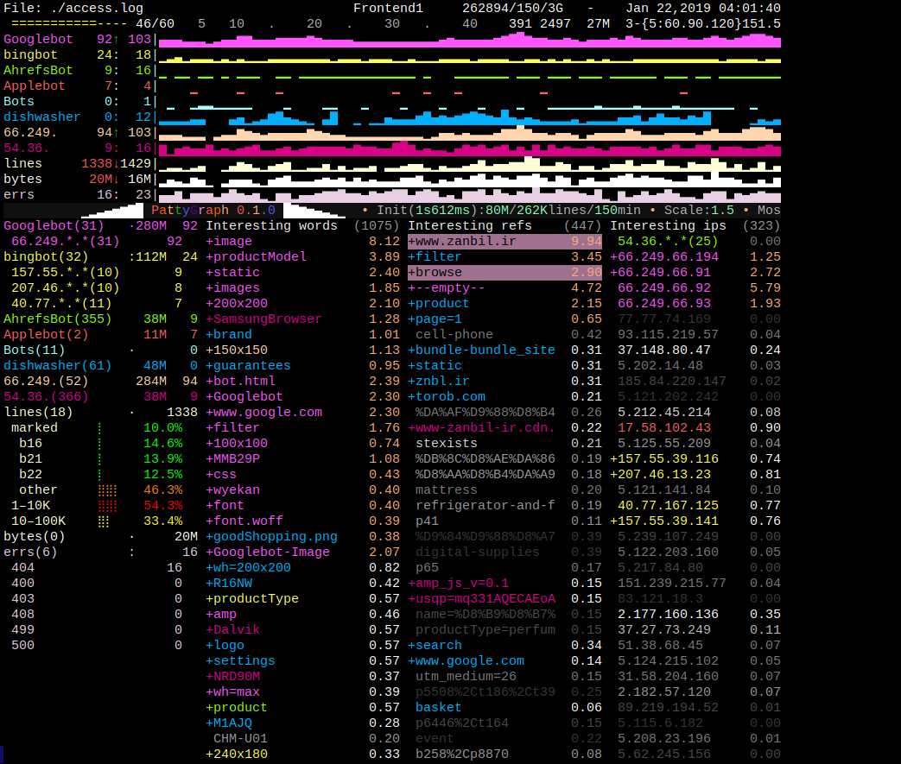

# PattyGraph

PattyGraph is a terminal-based, real-time access log analyzer for nginx-style logs. It highlights unusual or significant traffic patterns using sparklines, matchers, and ranked token/referrer/IP tables.

It’s designed for live ops use (tmux/screen) and forensics (replaying historical log windows), with a dense interactive display that helps you see traffic **shape** and how it changes over time.



## Download

Prebuilt Linux binaries are available from the PattyGraph 0.1.0 release page:

- [pattyGraph v0.1.0 release](https://github.com/jwminton/pattyGraph/releases/tag/v0.1.0)

## Features

- **Live traffic dashboard**: sparklines + interval-based stats over a rolling window
- **Matchers**: track known patterns and promoted sources (bots/scrapers/etc.)
- **Token tracking**: interesting URI/User-Agent tokens, referrers, and IPs
- **User-Agent analysis**:
  - residue buckets (post-cleanup token-count signature)
  - per-IP User-Agent drift (token-based distance)
- **Interactive UI**: clickable sparklines, selectable matchers, cross-highlighting, per-entry history sparklines
- **Inline commands** (`!!!`): runtime control and config injection through the log stream
- **Timed replay support**: `cmd/timedReplay` replays logs with original timing shape for demos/testing/forensics

## Quick Start

Build all targets (writes into `dist/`):

```bash
./compile.sh
````

Run (defaults to `./access.log` if no file is given):

```bash
./dist/linux-amd64/pattyGraph
# or
./dist/linux-amd64/pattyGraph /var/log/nginx/access.log
```

Helpful sub-help:

```bash
./dist/linux-amd64/pattyGraph --help
./dist/linux-amd64/pattyGraph --help layout
./dist/linux-amd64/pattyGraph --help inline
./dist/linux-amd64/pattyGraph --help colors
```

## TimedReplay (demo/testing/forensics)

TimedReplay is a small companion command under `cmd/timedReplay` that replays nginx access-log lines with controlled timing. It can be used to replay a historical window so PattyGraph can “watch the past” as if it were live. Typical use redirects timedReplay's stdout to a file that pattyGraph will then consume from another running session.

```bash
go run ./cmd/timedReplay/main.go -file ./access.1.log -speed 10 > ./replayed_access.log
```
```bash
pattyGraph ./replayed_access.log
```

## Inline Commands

Lines beginning with `!!!` are interpreted as commands rather than log lines. This is used for runtime control and for configuration files (a config file is just a sequence of inline commands).

Example:

```bash
echo '!!! purge' >> access.log
```

See:

```bash
./dist/linux-amd64/pattyGraph --help inline
```

## Documentation
(Planned and existing)

* Traffic texture model: `docs/traffic-texture.md`
* UI interaction and layout: `docs/interactive-ui.md`
* User-Agent residue buckets: `docs/user-agent-residue-profiling.md`
* User-Agent distance tracking: `docs/user-agent-distance.md`
* TimedReplay workflows: `docs/timed-replay.md`
* Architecture notes: `docs/architecture.md`
* Performance notes: `docs/performance-notes.md`

## Sample Data Policy

This repository does **not** distribute real access log data. Use logs you own/administer/are authorized to inspect. Screenshots may be taken from authorized or public datasets, but raw logs are not hosted in the repo.

## License

Apache-2.0. See [LICENSE](LICENSE).

```
