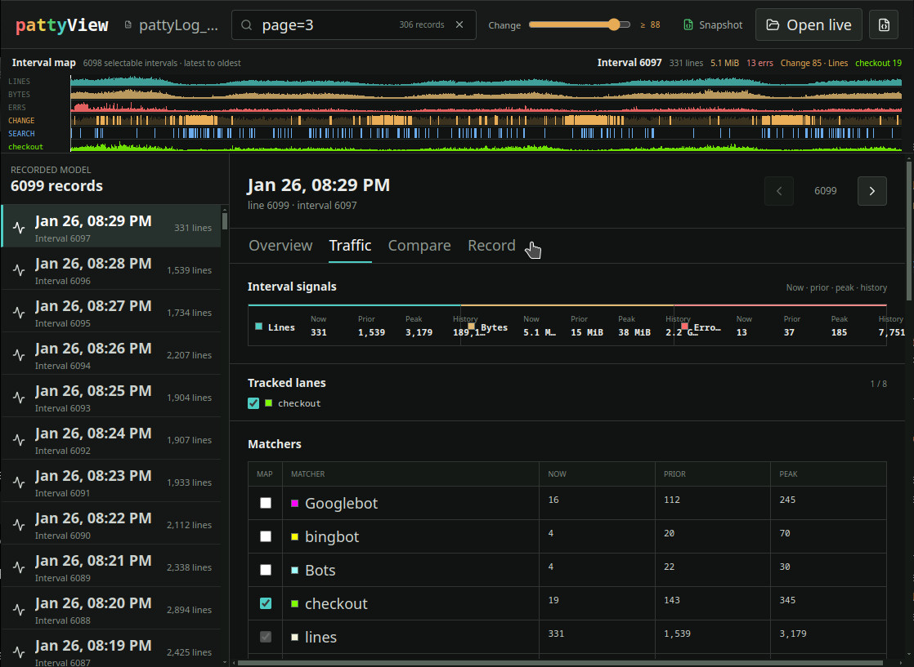

# pattyView

Turn a multi-gigabyte access log into a traffic history you can move through.

Logs are chronological. Investigations are comparative.

PattyGraph sees the traffic. PattyLog remembers the interpreted state. PattyView lets you move through it.

In a current large-file test, PattyGraph reduced 3 GB of access log into approximately 250 MB of structured PattyLog JSONL
in under a minute. PattyView loaded that recorded model faster than it was created, making the session searchable, comparable, and navigable
on an ordinary workstation.



## Find The Moment

A multi-gigabyte access log becomes a compressed interval map rather than a scrolling wall of requests. Lines, bytes,
errors, alerts, Change, matchers, and selected Words, Refs, or IPs become lanes across the same traffic history.

Search adds another lane. A known path, IP, referrer, factoid, or deployment marker immediately shows where it appears.

**Move through web traffic as intervals, signals, and evidence.**

An access log can grow by megabytes per second. PattyGraph reduces that stream
into a compact, interpreted PattyLog; PattyView opens the recorded model as a
local investigation workspace.

Use the interval map to find shifts in lines, bytes, errors, Change, alerts, or
selected traffic signals. Search emitted words, referrers, IPs, and factoids.
Compare intervals, inspect what moved, and follow retained examples back toward
the original log. Live following keeps the same investigative view current as
PattyGraph writes new records.

PattyGraph produces the traffic model. PattyView lets people explore the
recorded model.

PattyLog JSONL also provides that structured traffic context to AI agents, so
human operators and agents can examine the same recorded session through
representations suited to each.

## What You Can Investigate

- Scan an entire session through the compressed interval map.
- Track matcher activity and selected Words, Refs, or IPs as visual lanes.
- Search recorded traffic and operator factoids, then jump to matching records.
- Compare two intervals across traffic volume, Peaks, Change components, and
  recorded context.
- Review alerts, control events, factoids, and representative source lines in
  their log-time sequence.
- Follow a live PattyLog or open a fixed snapshot for later review and sharing.

PattyView is the local browser companion to
[PattyGraph](../../README.md).

[Run PattyView](#run-pattyview) | [Create a PattyLog](#pattylog-input) |
[Develop the frontend](#frontend-development) | [Verify](#verification)

## Run PattyView

The repository includes the production frontend under `cmd/pattyView/dist`, so
the Go launcher can be built or run without installing npm dependencies. To
rebuild everything from source first, generate `dist/` with Vite and then build
the Go launcher:

```bash
cd cmd/pattyView
npm ci
npm run build
cd ../..
go build -o pattyView ./cmd/pattyView
./pattyView
```

`npm run build` compiles the TypeScript and CSS frontend into `dist/`. The Go
build then embeds those generated files into the `pattyView` executable.

For a quick run using the production assets already committed to `dist/`, run
this from the PattyGraph repository root:

```bash
go run ./cmd/pattyView
```

Open `http://127.0.0.1:4177` in a browser. To retain a standalone executable
without rebuilding the frontend first:

```bash
go build -o pattyView ./cmd/pattyView
./pattyView
```

PattyView binds to loopback by default. Use `--listen` to select another address
or port:

```bash
./pattyView --listen 127.0.0.1:4180
```

Keep the listener on loopback for local investigations unless remote access is
deliberate.

## PattyLog Input

PattyView opens PattyLog JSONL produced by PattyGraph. Enable the default
`<save-dir>/pattyLog.jsonl` output with:

```bash
./pattyGraph --json /path/to/access.log
```

`--json-file <file>` selects a filename relative to `<save-dir>` and implies
`--json`. `--json-sources` adds retained representative source lines to
subsequent interval records; PattyView accommodates sessions where that setting
changes while PattyGraph is running.

Use **Open and follow** in a browser that provides the File System Access picker
to follow appended records. PattyView automatically offers snapshot opening
when that API is unavailable.

## Frontend Development

From the PattyGraph repository root:

```bash
cd cmd/pattyView
npm ci
npm run dev
```

Open `http://127.0.0.1:4177` and choose a PattyLog JSONL file. Vite owns the
development server, TypeScript build, and production asset generation.

## Production Assets

Frontend changes must regenerate the committed `dist/` tree used by Go's
`embed.FS`:

```bash
npm run build
```

Vite is the sole producer of `dist/`; edit the TypeScript, TSX, or CSS source
rather than generated assets. After a build, the static application can also be
served without the Go launcher:

```bash
python3 -m http.server 4177 --bind 127.0.0.1 --directory dist
```

Open `http://127.0.0.1:4177`. Python's standard-library server is one convenient
example; any static-file server can serve `dist/`.

## Verification

From `cmd/pattyView`:

```bash
npx playwright install chromium
npm test
npm run build
npm run test:e2e
```

The Playwright installation downloads the Chromium revision matched to the
project's Playwright version. On Linux CI hosts that also need browser system
packages, use `npx playwright install --with-deps chromium`.

From the repository root, verify the embedded launcher with the Go project:

```bash
go test ./...
go vet ./...
```

## Data Handling

PattyView reads the selected file in the browser. It does not upload PattyLog,
persist its contents in browser storage, or send records to another service.
The Go launcher serves embedded application assets only; PattyLog selection,
parsing, indexing, and retained state stay inside the browser.

Schema version 4 receives structured interval and event presentation. Unknown
schemas and event types remain available in the raw record view. Representative
source lines are optional per interval. See the
[PattyLog Schema Guide](../../docs/PATTYLOG_SCHEMA.md) for the recorded contract.
