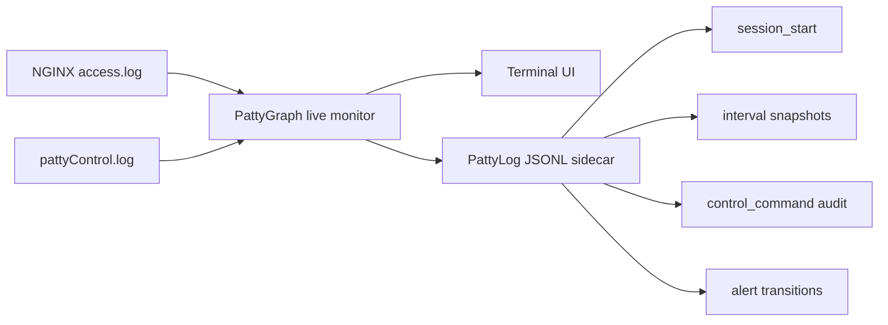
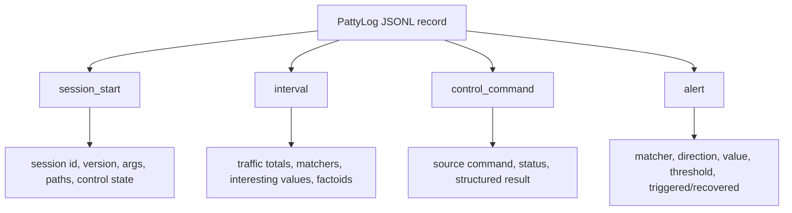
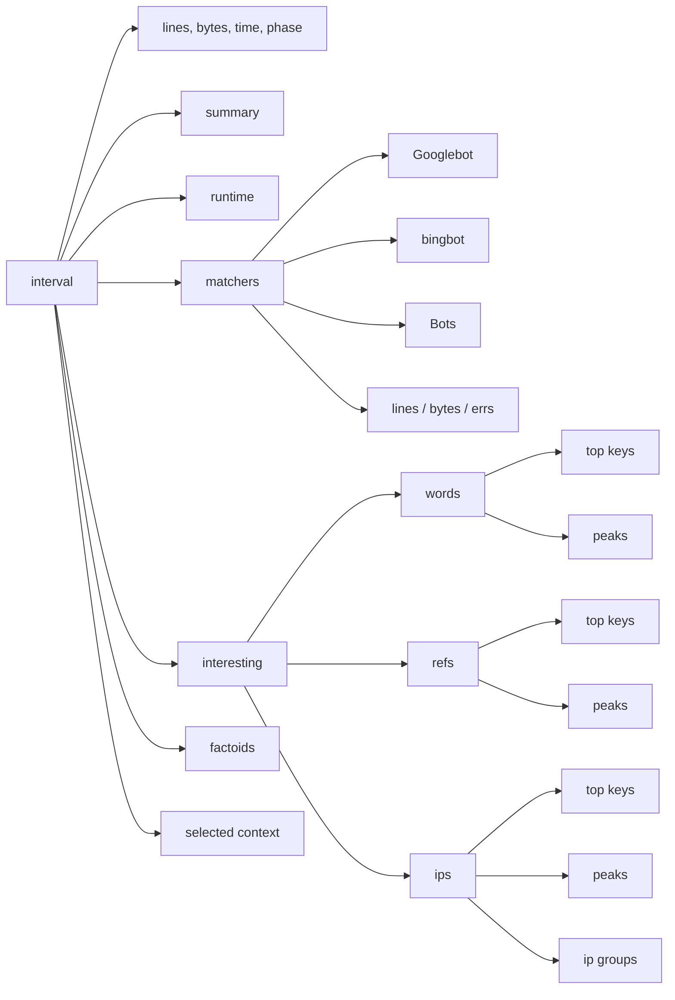
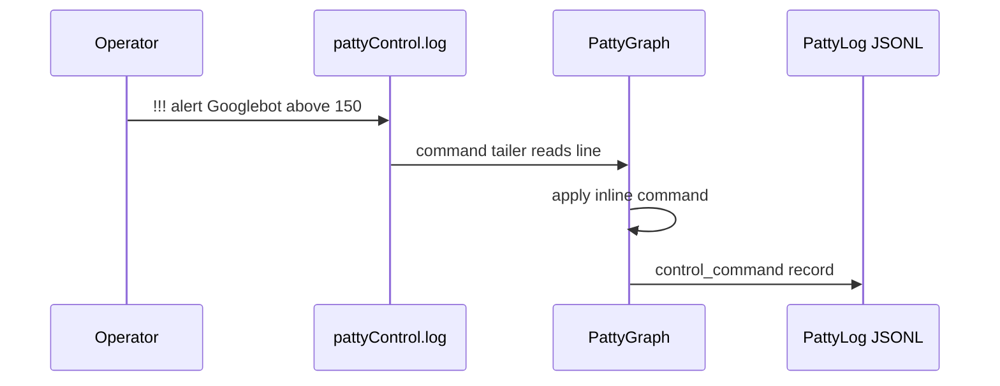
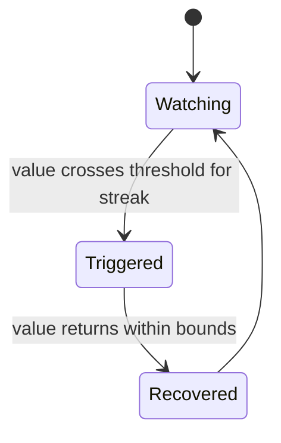

# PattyLog JSONL: Live Shape

PattyGraph writes a sidecar JSONL stream while it watches the access log. The
terminal stays human-first, while PattyLog gives automation and later analysis a
structured record of the same session.



The current v0.1.4 stream uses schema version `4`.

## Event Types



## Session Start

The first record describes how PattyGraph was launched and where the rest of the
session will write state.

```json
{
  "schema_version": 4,
  "event_type": "session_start",
  "session_id": "20260627_014141_3300800",
  "version": "0.1.4",
  "file_path": "./access.log",
  "output_path": "splats/pattyLog_20260627_014141_3300800.jsonl",
  "control_file_enabled": true,
  "control_file_path": "splats/pattyControl.log"
}
```

## Interval Snapshot

Interval records are the regular heartbeat of the sidecar stream. Each one
captures a slice of traffic and the state PattyGraph derived from it.



Compact example from the live replay:

```json
{
  "schema_version": 4,
  "event_type": "interval",
  "interval": 106,
  "timestamp": "2019-01-22T11:07:00-08:00",
  "interval_lines": 2913,
  "total_lines": 267236,
  "total_bytes": 3160998752,
  "matchers": [
    {
      "name": "Googlebot",
      "interval_count": 201,
      "top_keys": [
        {"key": "66.249.66.91", "count": 86, "rank": 1},
        {"key": "66.249.66.92", "count": 58, "rank": 2}
      ]
    }
  ],
  "interesting": [
    {
      "name": "words",
      "total_keys": 1709,
      "top": [
        {"key": "image", "score": 7886, "count": 1710, "rank": 1}
      ]
    }
  ]
}
```

## Control Commands

When `--control` is enabled, commands appended to `pattyControl.log` are also
written to PattyLog as audit records. That makes the stream show both what
PattyGraph saw and how the running session was steered.



Live example:

```json
{
  "schema_version": 4,
  "event_type": "control_command",
  "source": "control_file",
  "command": "!!! alert Googlebot above 150 # diagram sample",
  "command_name": "alert",
  "status": "applied",
  "control_file_enabled": true,
  "result": {
    "action": "set_alert",
    "matcher": "Googlebot",
    "direction": "above",
    "threshold": 150,
    "flux_depth": 3
  }
}
```

## Alert Transitions

Alert events are transition records. They are written when a configured bound
triggers or recovers, not merely when the alert is configured.



Shape:

```json
{
  "schema_version": 4,
  "event_type": "alert",
  "status": "triggered",
  "matcher": "errs",
  "direction": "above",
  "value": 83,
  "threshold": 50,
  "flux_depth": 3,
  "streak": 3,
  "interval": 42,
  "current_cycle": 60
}
```

The important part is that PattyLog is not just a dump of counters. It is the
session narrative: startup context, traffic snapshots, control actions, and
alert transitions in one append-only stream.
