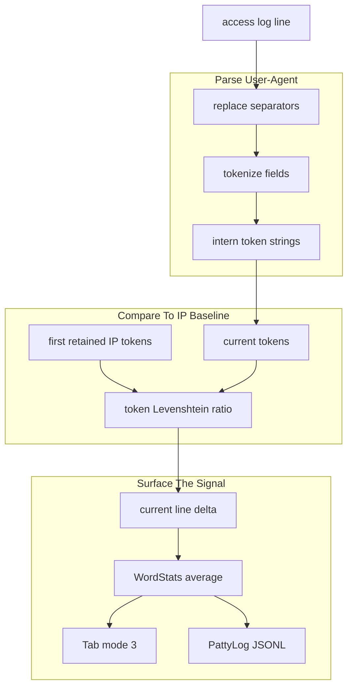
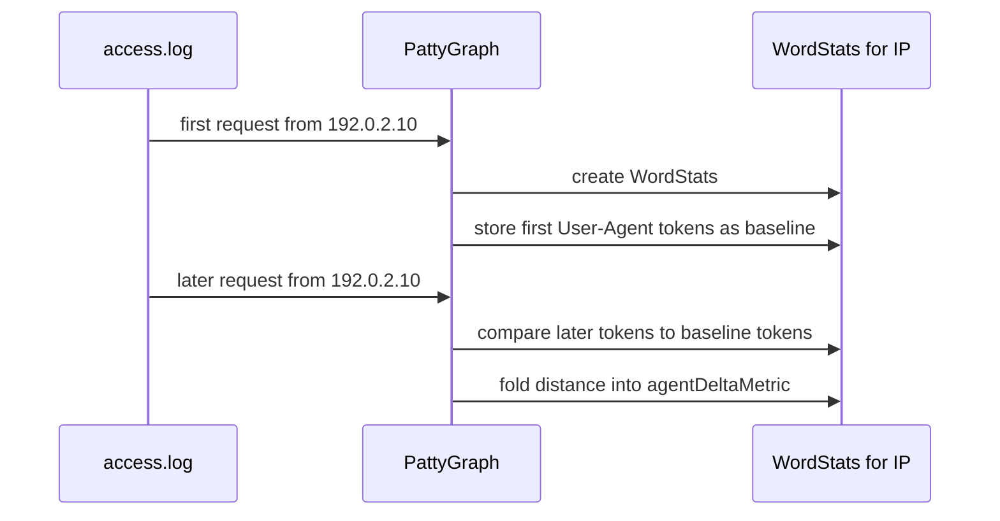
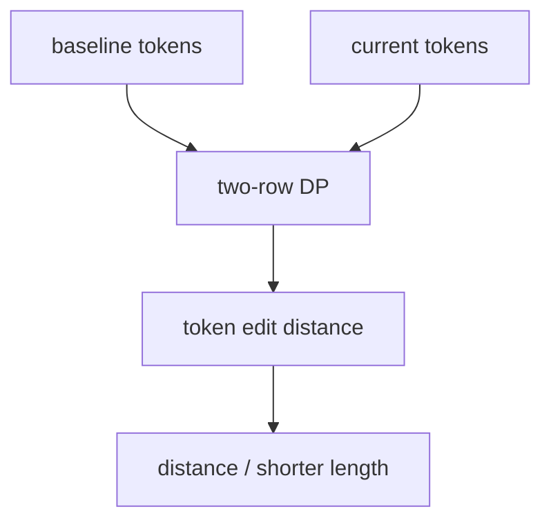
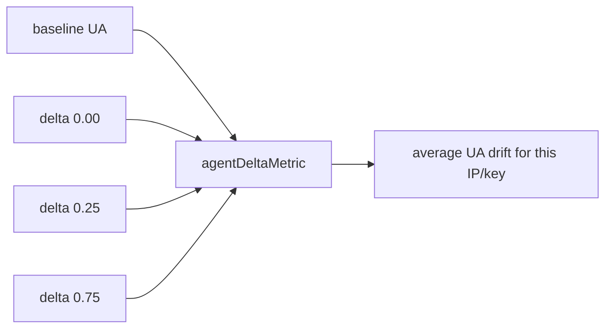

# Levenshtein Distance

PattyGraph uses Levenshtein distance to notice when an IP's User-Agent changes
shape over time. The implementation is intentionally token-based rather than
character-based: it compares User-Agent components as words/tokens, not as raw
strings.

The result is surfaced as `agentDeltaMetric` in `WordStats`, in PattyLog JSONL
as `agent_delta_metric`, and in the TUI through the Tab secondary-info cycle.

## Why Tokens Instead Of Characters

Raw character distance is too sensitive to small browser version changes and too
expensive to reason about visually. PattyGraph first tokenizes the User-Agent,
then computes edit distance across those tokens.

Example:

```text
UA A: Mozilla/5.0 (Linux; Android 10) Chrome/116.0.0.0 Mobile Safari/537.36
UA B: Mozilla/5.0 (Linux; Android 11) Chrome/117.0.0.0 Mobile Safari/537.36
```

Tokenized:

```text
A: Mozilla/5.0 | Linux | Android | 10 | Chrome/116.0.0.0 | Mobile | Safari/537.36
B: Mozilla/5.0 | Linux | Android | 11 | Chrome/117.0.0.0 | Mobile | Safari/537.36
```

At token level, that is mostly the same User-Agent with two substitutions:

```text
10                  -> 11
Chrome/116.0.0.0    -> Chrome/117.0.0.0
```

That produces a small ratio instead of treating every changed character as a
separate signal.

## The Token->Levenshtein Distance Pipeline



The User-Agent is tokenized once when the line is parsed. The resulting token
slice is stored on `currentLine.userAgentTokens` so later matcher work does not
repeat parsing.

## Per-IP Baseline

When PattyGraph sees an IP for the first time, the IP interesting matcher creates
a `WordStats` entry for that IP. That first entry stores:

```text
agentTokensFromSource = currentLine.userAgentTokens
```

That first observed token sequence becomes the baseline for future requests from
the same IP.



Important consequence: PattyGraph does not compare each request to the previous
request from the IP. It compares later requests to the first User-Agent token
baseline retained for that IP's current `WordStats` lifetime.

If the IP ages out and its `WordStats` is recycled, a future appearance can
establish a new baseline.

## Distance Ratio

The token-level Levenshtein function returns a ratio:

```text
edit distance / shorter token length
```

Rough interpretation:

```text
0.0   exact token match
0.14  small variation
0.57  major difference
1.0+  strongly divergent
2.0   one side had no tokens
```

The implementation uses a two-row dynamic-programming workspace instead of a
full matrix. That keeps memory small and allows scratch reuse:



This is still Levenshtein distance, but the edit units are User-Agent tokens.
Insertions, deletions, and substitutions operate on whole tokens.

## Folding Into WordStats

The computed distance first lives on the current parsed log line:

```text
currentLine.userAgentDelta
```

When the IP matcher updates the IP's `WordStats`, PattyGraph folds that value
into an average:

```text
agentDeltaMetric = weighted average of observed userAgentDelta values
```

That means one odd request can move the value, but repeated User-Agent changes from the same IP make the metric more meaningful.



The metric also feeds other derived behavior. For example, `WordStats`
normalization and burstiness are scaled by `agentDeltaMetric`, so User-Agent
drift can make a key feel more interesting even when raw count is not the whole
story.

## Where The TUI Shows It

The most direct TUI view is Tab mode `3`.

In `docs/TAB_VIEW_CYCLES.md`, mode `3` is the User-Agent delta view:

```text
Tab mode 3 -> averaged user-agent delta percent
```

For individual IP entries, this is the IP's `WordStats.agentDeltaMetric`.

For IP prefix groups, PattyGraph averages the member IP deltas and shows that
aggregate value. This makes the prefix view useful when a cluster of related IPs
is changing User-Agent behavior together.

## Where JSONL Shows It

PattyLog exposes this signal in several places.

Interesting entries include:

```json
{
  "key": "192.0.2.10",
  "agent_delta_metric": 0.2857,
  "burstiness": 0.42,
  "marked_state": "unmarked"
}
```

IP group entries can also include:

```json
{
  "prefix": "192.0.",
  "agent_delta_metric": 0.19,
  "members": 12
}
```

Selected source context may include parsed User-Agent fields, but the main
long-lived distance signal is `agent_delta_metric` on the tracked interesting
entry. Selection exposes the source lines behind a key; it does not recompute
the distance.

## What This Signal Means

High User-Agent distance for an IP can mean:

- a real client upgraded or changed browser versions
- a NAT or proxy address represents many different clients
- a bot rotated User-Agent strings
- scraper behavior is pretending to be multiple clients
- a single IP is mixing tool traffic and browser traffic

Low distance usually means the IP's User-Agent shape is stable.

The metric is not a verdict. It is a reason to look closer.

## What To Trust

Trust this signal as a compact measure of User-Agent drift relative to the first
User-Agent PattyGraph retained for that IP.

Do not treat it as:

- identity proof
- bot detection by itself
- exact character-level string similarity
- comparison against every previous request
- a raw-log replacement

For investigation, the intended flow is:

1. Use Tab mode `3` or PattyLog `agent_delta_metric` to spot drift.
2. Select the IP or IP prefix.
3. Inspect `first_source`, `first_interval_source`, and `last_source`.
4. Go back to the raw access log when the drift looks meaningful.

The design goal is not perfect string distance. It is a fast, explainable signal
that helps the TUI surface when an IP's User-Agent identity starts moving.
