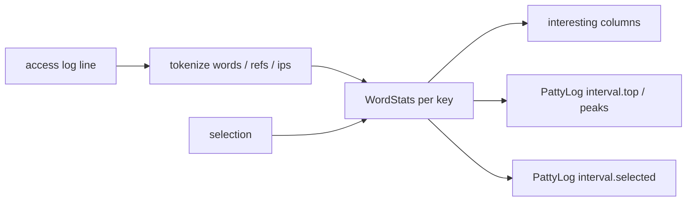
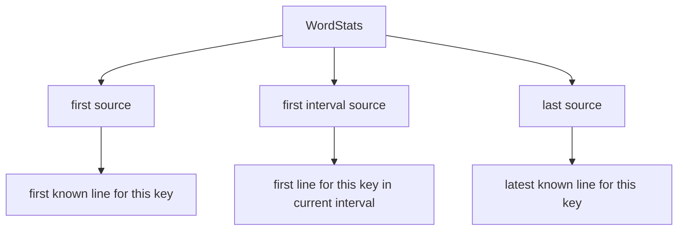
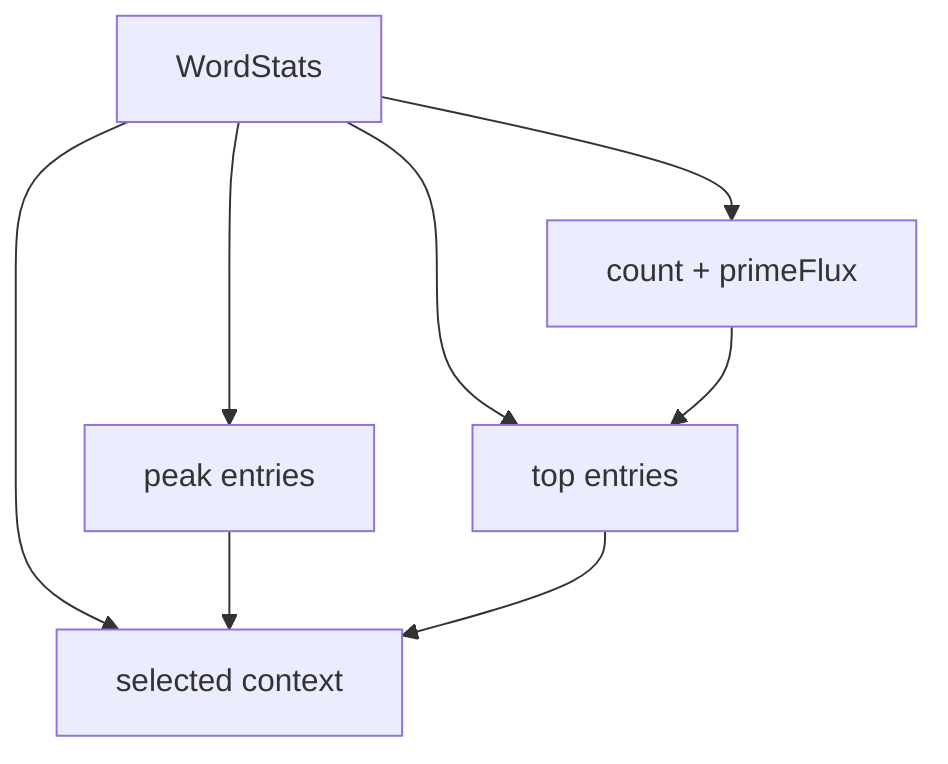
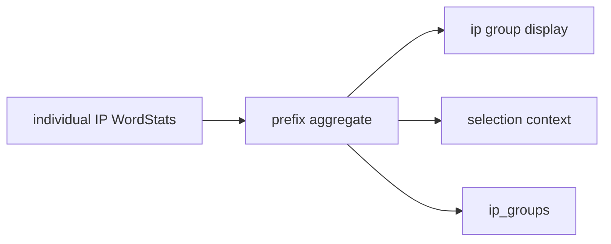

# Selection Deep Dive

Selection in PattyGraph is not a data-collection mode. It is a way to expose
state PattyGraph is already maintaining for interesting words, refs, and IPs.

The key internal object is `WordStats`. Despite the name, it backs all three
interesting streams:

- `words`
- `refs`
- `ips`

Each interesting stream keeps a map like:

```text
key -> WordStats
```

When the UI or an inline command selects a key, PattyGraph looks up the existing
`WordStats` for that key and surfaces the context already attached to it.



## What WordStats Tracks

`WordStats` is the per-key memory that lets PattyGraph say more than "this token
appeared N times." It tracks current interval activity, rolling history, source
context, visual marking, and enough derived metrics to rank what looks
interesting.

Conceptually, each key has:

- current interval count
- current interval bytes
- rolling history of prior interval counts
- `primeFlux`, a short-window change metric
- burstiness
- averaged user-agent delta
- last seen cycle
- last status code
- first source line for the key
- first source line in the current interval
- last source line seen for the key
- matcher color/markup when a matcher marked the source line

The important trust point: these fields are maintained during normal ingestion.
Selecting a key does not make PattyGraph go back and collect more data.

## Source-Line Context

For investigation, the most useful `WordStats` fields are the source-line
pointers:



In PattyLog selection output, they become:

- `selected.first_source`
- `selected.first_interval_source`
- `selected.last_source`

Each source object is parsed into fields such as:

- `ip`
- `ip_prefix`
- `request`
- `response_code`
- `bytes_value`
- `referer`
- `user_agent`
- `marked_state`
- `marked_by_matcher`

This is why selecting a noisy ref like `product` can immediately show a first
example, a current-interval example, and a latest example without doing a raw-log
search.

## TUI Source Line Under The Sparkgraph

When an interesting key is selected in the TUI, PattyGraph adds a selected-key
sparkline to the sparkgraph pane. The source log line printed below that
sparkline is controlled by the active Tab view.

The selected key itself does not change when Tab is pressed. Tab changes which
stored source pointer is shown as the focused example:

| Tab mode | Source line shown below selected sparkgraph |
| --- | --- |
| `0` ratio / burst | first source line for the key |
| `1` flux | first source line for the key in the current interval |
| `2` history depth | latest source line for the key |
| `3` user-agent delta | latest source line for the key |
| `4` mini sparkline | latest source line for the key |
| `5` bytes | latest source line for the key |

This means the selected sparkline stays anchored to the same `WordStats`, while
the line underneath follows the same investigative lens as the current Tab mode:
first seen, current-interval first seen, or latest seen.

PattyLog is more explicit than the TUI here. It can expose
`first_source`, `first_interval_source`, and `last_source` together in the same
`selected` object instead of choosing only one line for display.

## What Selection Shows

Interesting-item selection can target:

```text
!!! select --words <key>
!!! select --refs <key>
!!! select --ips <key-or-prefix>
```

When the selection is active, interval JSONL records include a `selected`
object:

```json
{
  "selected": {
    "interesting_matcher": "refs",
    "interesting_key": "product",
    "first_source": {
      "ip": "188.159.31.33",
      "request": "GET /settings/logo HTTP/1.1",
      "response_code": "200",
      "bytes_value": 4120,
      "marked_state": "unmarked"
    },
    "first_interval_source": {
      "ip": "78.157.44.9",
      "request": "GET /image/13499/product/50x50 HTTP/1.1",
      "response_code": "200",
      "bytes_value": 1074,
      "marked_state": "unmarked"
    },
    "last_source": {
      "ip": "204.18.37.154",
      "request": "GET /static/images/guarantees/goodShopping.png HTTP/1.1",
      "response_code": "200",
      "bytes_value": 6496,
      "marked_state": "unmarked"
    }
  }
}
```

That example is intentionally shortened. The real JSONL may also include the raw
`log_line`, full referer, user agent, user-agent tokens, capture color, and
matcher metadata.

## Top, Peaks, And Selection

The same `WordStats` records feed the `interesting.top`, `interesting.peaks`,
and `selected` sections in PattyLog.



For `words`, `refs`, and `ips`, PattyLog entries expose:

- `key`
- `rank`
- `score`
- `count`
- `bytes`
- `prime_flux`
- `burstiness`
- `agent_delta_metric`
- `history_total`
- `history_peak`
- `history_depth`
- `last_seen_tic`
- `last_status`
- `marked_state`
- `marked_by_matcher`
- `is_peak`

Selection does not create a separate view of reality. It points at one of those
same tracked keys and expands the source context around it.

## IP Prefix Selection

`ips` has one extra layer: prefix grouping.

PattyGraph tracks individual IPs as interesting keys, but it also builds grouped
prefix stats for display and selection. Those grouped stats are "WordStats-like"
objects assembled from the member IPs.



This is why an IP selection may represent either a concrete IP or an aggregate
prefix. In both cases, PattyGraph is still exposing state already collected
during normal matching.

## Marked Versus Unmarked

Source context includes marking metadata:

- `marked_state: "marked"` means a matcher marked the line.
- `marked_state: "unmarked"` means no matcher markup was attached.
- `marked_by_matcher` names the matcher when the line was marked.

This matters because an interesting key can be notable on its own, or notable
because it is associated with a matcher such as `Googlebot`, `bingbot`, `Bots`,
or a user-created matcher.

## How To Read It

When reviewing a selected key:

1. Use `interesting_matcher` and `interesting_key` to identify the selected
   stream and key.
2. Use `first_source` to understand where PattyGraph first learned about it.
3. Use `first_interval_source` to see how it appeared in the current interval.
4. Use `last_source` to see the latest known example.
5. Use `marked_state` and `marked_by_matcher` to tell whether a matcher already
   explains the line.
6. Use the original access log for full forensic detail when the selected
   context points at something worth deeper inspection.

Selection is therefore best understood as an investigative lens over
`WordStats`: it turns the data PattyGraph is already maintaining into a focused,
explainable slice of the session.
