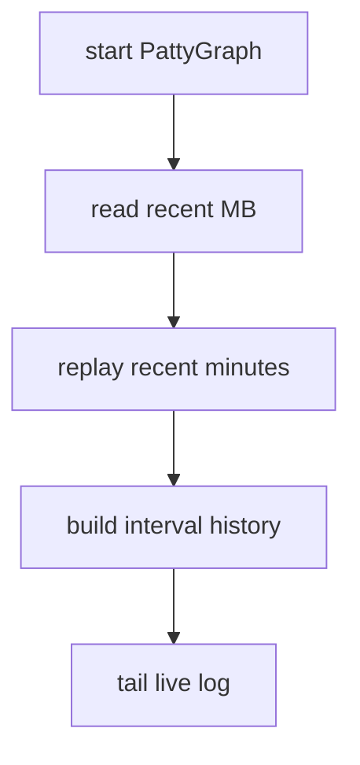
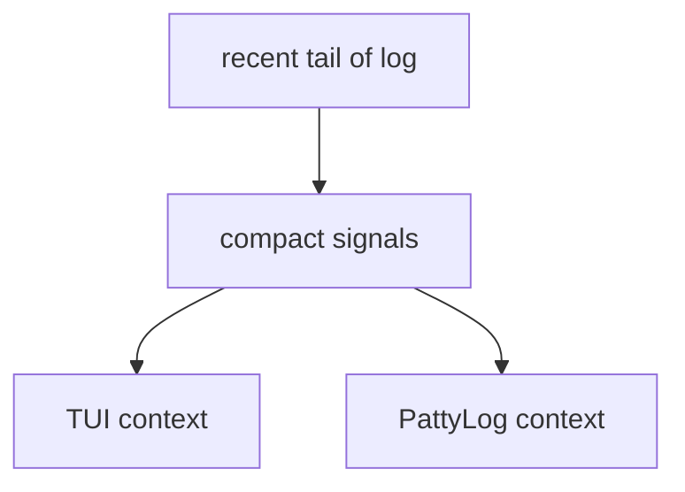
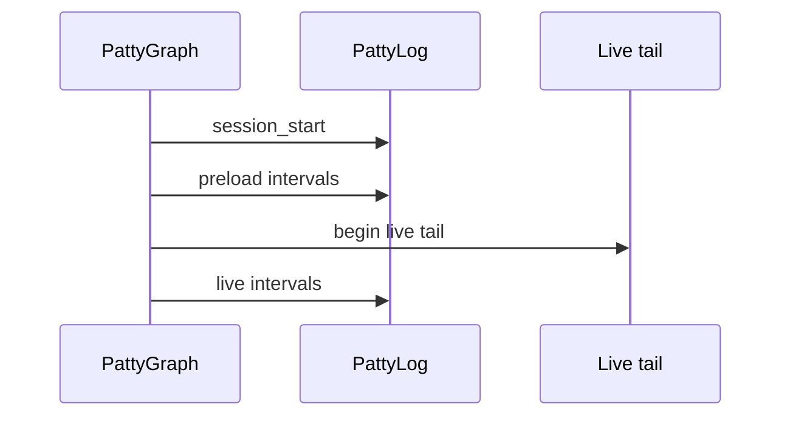

# Startup Speed (aka: 'Instant On')

PattyGraph is designed to become useful almost immediately.

On a typical development machine, PattyGraph can read and summarize about
`80 MB` of existing NGINX access log in roughly a second. That startup preload
is not just a warm-up step. It gives the TUI and PattyLog enough recent context
to show traffic shape before live tailing takes over.

The exact number depends on disk, CPU, log-line size, and active options. The
important behavior is that PattyGraph can build a recent operational picture
from tens of megabytes of log data fast enough that startup still feels
interactive.

## Why Startup Speed Matters

Live log tools have a cold-start problem. If the tool only watches new lines,
the first screen starts empty and the operator has to wait for enough traffic to
arrive.

That is not ideal during an incident or investigation. The useful question is
usually:

```text
What has been happening recently, and what is happening now?
```

PattyGraph answers that by preloading recent log data, grouping it into interval
history, and then switching into live monitoring.



## The `--read` Window

The `-r` / `--read` option controls how many megabytes PattyGraph reads from the
end of the log file at startup.

```bash
pattyGraph --read 80 /path/to/access.log
```

The default is currently `50 MB`. Larger values give more startup context.
Smaller values start faster and keep generated PattyLog startup output smaller.

For AI-assisted or automation-friendly sessions, a bounded read is usually the
right default:

```bash
pattyGraph --json --control --read 10 /path/to/access.log
```

That gives downstream readers immediate context without making raw-log ingestion
the main workflow.

## What The Preload Builds

Startup preload is not a raw text dump. PattyGraph reads the recent tail of the
file and folds it through the same matcher and interesting-value machinery used
for live traffic.

The preload contributes to:

- matcher counts and history
- `Bots`, promoted bot, line, byte, and error rows
- interesting `words`, `refs`, and `ips`
- IP prefix grouping
- selected context when later chosen
- startup interval records in PattyLog JSONL when `--json` is enabled

By the time the TUI appears, the screen can already show recent traffic shape
instead of starting from zero.

## What It Does Not Do

Startup preload is intentionally bounded.

It does not try to index the entire access log. It does not replace long-term
log storage, search, or forensic tooling. It reads enough recent data to give
the live session useful context, then PattyGraph follows the log as it grows.

That distinction keeps startup fast:



## Visible Startup Feedback

PattyGraph reports startup preload work through its fact stream. The startup
fact includes:

- elapsed preload time
- bytes read
- lines read
- interval minutes built

In practice, that makes startup speed visible inside the same operational
surface as the rest of the session.

A typical startup fact looks conceptually like:

```text
Init(1s):80M/200klines/80min
```

The exact formatting is compact because it appears in the terminal ticker.

## Relationship To PattyLog

When PattyLog JSONL is enabled, startup replay intervals are written before live
tail intervals. That gives automation and later review immediate context about
the recent traffic window.

This matters for signal-first workflows. A reader can inspect a fresh PattyLog
file and see useful interval state without waiting several minutes for live
traffic to accumulate.



## Tuning Guidance

Use a smaller preload when:

- startup latency matters more than historical context
- an agent only needs a quick current-state view
- the log is extremely hot and recent lines are enough
- PattyLog output should stay very small

Use a larger preload when:

- traffic is bursty and needs more history
- bot or IP behavior has been building for several minutes
- you want the TUI to open with fuller sparkline context
- you are replaying or investigating a captured incident window

The point is not to read the biggest possible file. The point is to read enough
recent log data to make the live session immediately useful.

## Short Version

PattyGraph's fast startup preload lets it turn tens of megabytes of existing
access log into useful TUI and PattyLog context in about a second on ordinary
hardware. That makes the first screen meaningful instead of empty, while keeping
the raw log available for exact follow-up when needed.
