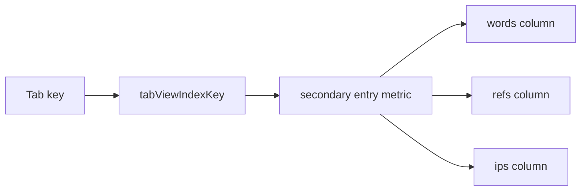
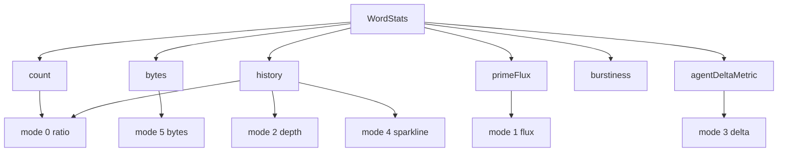

# Tab View Cycles

In the PattyGraph TUI, `Tab` changes the secondary value shown beside each
interesting entry. The primary columns still show `words`, `refs`, and `ips`;
Tab changes the compact metric printed on the right side of each entry.

This is a TUI-facing display cycle. It does not change what PattyGraph
collects. It changes which part of the existing `WordStats` state is emphasized.



`tabViewIndexKey` cycles through six modes with the status line shows a small glyph for the active mode:

```text
0:-  1:/  2:|  3:\  4:=  5:_
```

## The Six Modes

| Tab | Display        | words / refs meaning                 | ips meaning                              |
| --- | -------------- | ------------------------------------ | ---------------------------------------- |
| `0` | ratio / burst  | normalized interest ratio            | burstiness                               |
| `1` | flux           | `primeFlux`                          | prefix or IP `countPlusFirst`            |
| `2` | history depth  | number of retained history intervals | prefix/IP history depth                  |
| `3` | agent delta    | averaged user-agent delta percent    | averaged prefix user-agent delta percent |
| `4` | mini sparkline | compact history sparkline            | aggregate prefix/IP sparkline            |
| `5` | bytes          | bytes in current interval            | prefix/IP bytes in current interval      |

## Mode 0: Ratio Or Burstiness

For `words` and `refs`, mode `0` shows the normalized interest ratio:

```text
stats.normalized() / normalizedDenominator
```

This is the closest display to "how interesting is this token relative to the
current traffic shape?"

For `ips`, mode `0` shows burstiness instead. IPs tend to be more useful when
ranked by abruptness or texture rather than by the same ratio used for words and
refs.

## Mode 1: Prime Flux

Mode `1` shows short-window movement.

For normal interesting entries, this is `primeFlux`, which is maintained on
`WordStats` as a hot-path value. Conceptually, it combines current activity with
recent history so rapidly changing keys stand out averaged over a "primeFlux" count of intervals.

For IP prefix groups, this becomes `countPlusFirst`, the grouped score used to
rank active prefixes.

## Mode 2: History Depth

Mode `2` shows how much retained history exists for the entry.

Examples:

```text
[3]
[47]
[80]
```

This helps distinguish a brand-new spike from a long-lived pattern. PattyGraph's
default retained history depth is `80`, so `[80]` means the key has a full
history window.

## Mode 3: User-Agent Delta

Mode `3` shows averaged user-agent delta as a percent.

For `words`, `refs`, and individual IP entries, this comes from
`agentDeltaMetric` on `WordStats`. For IP prefix groups, PattyGraph averages the
member IP deltas.

This view is useful when a key is not just active, but associated with changing
or unusual user-agent behavior.

The delta is based on token-level Levenshtein distance. PattyGraph does not
compare raw User-Agent strings character by character. During log-line parsing,
it replaces separators, splits the User-Agent into tokens, interns those token
strings, and stores the token slice on the current parsed line.

For an IP address, the first retained User-Agent token sequence becomes that
IP's baseline. Later requests from the same IP are compared against that
baseline:

```text
baseline tokens from first retained request
current request tokens
        |
        v
token Levenshtein edit distance
        |
        v
distance / shorter token length
        |
        v
currentLine.userAgentDelta
        |
        v
WordStats.agentDeltaMetric
```

Because the edit units are tokens, a browser version change is usually a small
movement instead of a noisy character-level change. For example:

```text
Mozilla/5.0 | Linux | Android | 10 | Chrome/116.0.0.0 | Mobile | Safari/537.36
Mozilla/5.0 | Linux | Android | 11 | Chrome/117.0.0.0 | Mobile | Safari/537.36
```

Those two token sequences differ by two substitutions across seven tokens, so
the ratio is roughly:

```text
2 / 7 = 0.2857
```

Mode `3` renders that kind of value as a percent. An `agentDeltaMetric` of
`0.2857` appears as approximately:

```text
  28%
```

The value is an average over observations folded into the entry's `WordStats`,
not just the most recent request. A stable IP with repeated matching
User-Agents trends toward `0%`. An IP that keeps rotating browser families,
platforms, tools, or bot strings trends higher.

For prefix rows, the display is one level more aggregated:

```text
sum(member IP agentDeltaMetric) / member IP count
```

That makes mode `3` useful for spotting subnet-shaped behavior. A single
changing IP can be investigated directly, while a high prefix percentage hints
that several related IPs are drifting together.

Important limits:

- `0%` means the retained token shape is stable, not that the client identity is
  proven.
- A high value means "User-Agent shape changed relative to the retained
  baseline", not automatically "bot".
- The comparison is against the first retained baseline for that IP's current
  `WordStats` lifetime, not against every previous request.
- The displayed percent is truncated to an integer for compact TUI output.

## Mode 4: Mini Sparkline

Mode `4` shows a compact sparkline for the entry's retained history.

For `words` and `refs`, it is built from the selected key's `WordStats` history.
For IP prefix groups, it is built from the aggregate history of the prefix
members.

The `[` and `]` keys move the mini-sparkline window by five positions. That
changes which part of the retained history is emphasized in the compact display.

## Mode 5: Bytes

Mode `5` shows bytes observed for the entry in the current interval.

This is useful when count alone is misleading. A low-count key with large byte
volume can be more important than a high-count key made of tiny responses.

## What Changes Visually

Tab only changes the secondary metric at the right side of interesting entries.
It does not change:

- the primary key text
- whether entries are marked by matchers
- the selected key
- the underlying `WordStats`
- the PattyLog JSONL schema

It can change perceived importance because the TUI is showing a different
projection of the same tracked state.



## Demo Mode

The inline `demo` command advances the tab view automatically about every ten
seconds:

```text
!!! demo
```

Pressing `Tab` while demo mode is active stops demo mode instead of advancing
the tab index. After demo mode is stopped, pressing `Tab` resumes normal manual
cycling.

## Relationship To PattyLog

PattyLog already contains the underlying values that feed these views:

- `count`
- `bytes`
- `prime_flux`
- `burstiness`
- `agent_delta_metric`
- `history_total`
- `history_peak`
- `history_depth`
- optional `history`

The tab cycle itself is not currently recorded as a separate PattyLog event.
That is reasonable because Tab is a presentation choice, not a state change in
the monitored traffic.

If PattyGraph later needs exact UI replay, the active `tabViewIndexKey` could be
added to interval runtime or UI-state metadata. For current forensic and AI
operation, the important thing is that the raw metrics are already in PattyLog.

## How To Read The Cycle

Use the tab modes as lenses:

- Mode `0`: What looks interesting right now?
- Mode `1`: What is moving?
- Mode `2`: Is this new or long-lived?
- Mode `3`: Is user-agent behavior changing?
- Mode `4`: What does the recent shape look like?
- Mode `5`: Where is the byte volume?

The value of Tab is that the same `WordStats` population can be read six
different ways without changing the underlying collection.
