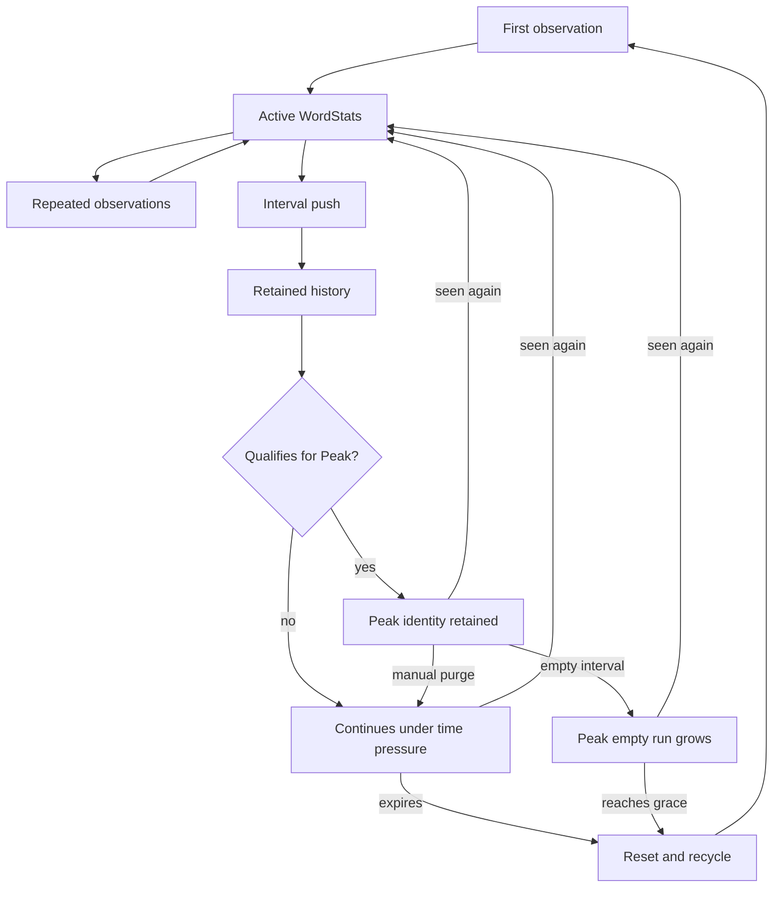

# WordStats Lifecycle

PattyGraph gives every interesting key a compact, recency-biased memory.
`WordStats` is that memory.

The name comes from the Interesting Words column, but the same structure backs
all three interesting streams:

- words
- refs
- IPs

Each stream maintains a working set shaped like:

```text
key -> WordStats
```

That small relationship is central to PattyGraph's operation. A key can arrive,
repeat, build interval history, accumulate context, become Peak, fade under
log-time pressure, and eventually give its storage to a new key. The TUI and
PattyLog JSONL both read from this retained state.

## Lifecycle At A Glance



The arrows represent semantic state rather than separate goroutines or queued
jobs. Per-line updates, interval pushes, and display reads operate on the same
compact record.

## First Observation

When an interesting key appears for the first time, PattyGraph obtains a
`WordStats` from its reuse pool and initializes a new lifetime for that key.

The first observation establishes:

- a current interval count of one
- the response bytes from the line
- an initial `primeFlux` of one
- the current log-time position
- the response status
- the first source line for the key
- the first source line in the current interval
- the latest source line
- any matcher color and matcher identity attached to the line

For an IP, the entry also retains an independent copy of the initial
User-Agent tokens. That baseline supports later User-Agent distance
measurements without retaining every User-Agent string seen for the IP.

All three source views initially point at the same observation:

```text
first source          first known line for this WordStats lifetime
first interval source first line in the current interval
latest source         most recent line seen
```

Their meanings separate as more traffic arrives.

## Repeated Observations

Every later hit for the key updates the live record in place. PattyGraph keeps
this path deliberately thin because it runs for every retained key extracted
from every parsed log line.

A repeated observation updates:

- current interval count
- current interval bytes
- `primeFlux`
- last-seen log time
- latest response status
- latest source line
- first source line for the interval, when this is the interval's first hit
- capture color and matcher provenance when the line was marked
- the running User-Agent delta measurement

The lifetime-first source line remains stable. Its capture metadata can evolve
when a later observation is marked, so the retained source combines the first
example with retained matcher provenance for the key's current lifetime.

PattyGraph retains compact state rather than a list of matching log lines. The
source examples provide investigative anchors; the original access log remains
the forensic record.

## Interval Push

PattyGraph divides retained activity into 60-second intervals and keeps at most
80 completed intervals for each surviving entry. During startup replay, these
boundaries are reconstructed from log time. During live operation, the active
tail advances the same interval model.

At an interval push, each active entry:

1. moves its current count into the history ring
2. refreshes `primeFlux` from the configured recent-history depth
3. clears the current count and byte count
4. clears the first source line for the completed interval
5. keeps its lifetime-first and latest source lines
6. invalidates derived history views so they can be rebuilt when needed

Zero-hit intervals are also meaningful while an entry remains active. They
become part of its retained shape and help distinguish steady repetition from a
short burst.

The history ring caps memory while preserving enough depth for sparklines,
burstiness, PattyFactor, Peak decisions, and agent-facing summaries.

## Current State And History

The live interval and completed history intentionally remain distinct.

```text
count       hits in the current interval
bytes       response bytes in the current interval
history     counts from completed intervals
primeFlux   current count plus configured recent history
```

Immediately after a push, `count` and `bytes` are zero. `primeFlux` still
reflects recent completed intervals. New hits then add current pressure to that
retained pressure.

This lets the interesting columns react immediately while preserving enough
memory to recognize sustained behavior.

## Time Pressure And Expiry

Every ordinary `WordStats` lives under log-time pressure. The Words, Refs, and
IPs streams have separate retention windows derived from `--push`, allowing
each working set to age at a rate appropriate to its expected breadth.

The last-seen log time is compared with the stream's current retention window.
When a non-Peak entry falls outside that window, PattyGraph removes it from the
stream and recycles its storage.

Expiry can be recognized in two places:

- during an interval push, while the working set is being aged
- when a previously known key reappears after its old lifetime has expired

In the second case, the old state is recycled and the observation immediately
starts a fresh `WordStats` lifetime. Old history and old source context do not
become evidence for the new lifetime.

This is the garbage-collector-like part of PattyGraph's design. Repetition and
recent context keep useful entries alive. Shallow, quiet entries lose their
place without forcing the display into a fixed all-time top list.

See [Time Pressure](TIME_PRESSURE.md) for the operator-facing behavior of
`--push`, `--scale`, `--grace`, `primeFlux`, and Peak.

## Peak Retention

After the configured grace period, a sufficiently strong entry can become
Peak when its interesting column has capacity. Peak preserves the identity of a
key that has earned a durable place in the traffic shape. Each Words, Refs, and
IPs column has a bounded capacity controlled by `--peak-limit`.

A Peak remains protected from ordinary time pressure. Every completed interval
still pushes its accumulated count into history, including zero when the key
receives no hits. A hit resets the consecutive-empty count.

When the empty run reaches `grace`, PattyGraph retires the Peak and recycles its
`WordStats`. This bounds longer-lived memory while giving a quiet key the same
configured interval depth that originally governed its Peak eligibility.

Lowering `peak-limit` preserves current members and blocks new admission until
retirement or purge creates capacity. An explicit Peak purge removes protection
from the full Peak set and establishes a fresh baseline for Change.

## Selection Does Not Pin State

Selecting a Word, Ref, IP, or IP prefix changes how retained state is exposed.
It does not change collection, ranking, aging, or Peak eligibility.

Interesting-item selection remembers a logical key rather than holding a
permanent pointer to a `WordStats`. If an ordinary selected entry expires, its
old state remains eligible for recycling. A future appearance of the same key
can establish a fresh lifetime.

This keeps investigation separate from retention policy. Human attention does
not silently alter the traffic model.

See [Selection Deep Dive](SELECTION_DEEP_DIVE.md) for the TUI and PattyLog views
of selected state.

## IP Prefixes Are Aggregates

Individual IP addresses own normal persistent `WordStats` records. IP-prefix
rows are different: PattyGraph assembles them from active member IP records for
display and output.

These prefix records are `WordStats`-shaped projections. They combine member
counts, histories, source examples, bytes, capture colors, burstiness, and
User-Agent movement so the existing display and selection machinery can read
them consistently.

They do not have an independent ingestion lifetime. Their shape follows the
current population of individual IP records.

## Recycling Without Semantic Leakage

Expired non-Peak entries return to a `sync.Pool`. Reuse preserves expensive
storage where useful:

- the fixed history buffer
- the reusable `lineSource`
- User-Agent token-slice capacity

Before reuse, PattyGraph clears retained history, token contents, and capture
metadata. The next initialization overwrites the semantic fields for the new
key.

This gives PattyGraph allocation control without carrying identity, history,
or source meaning from one key into another. The pool is an implementation
resource; it does not extend a key's logical lifetime.

## Display And PattyLog Are Readers

The same persistent records feed several surfaces:

- Interesting Words, Refs, and IPs rows
- secondary Tab measurements
- selected-item sparklines and source examples
- Peak entries
- IP-prefix aggregates
- PattyLog `interesting.top`, `interesting.peaks`, and `selected` content

Display does not create the underlying observations. PattyLog does not require
a second analysis pass. Both read the compact state PattyGraph already
maintains while processing traffic.

See [Tab View Cycles](TAB_VIEW_CYCLES.md) for the metrics projected from
`WordStats`, and [Levenshtein Distance](LEVENSHTEIN_DISTANCE.md) for the retained
User-Agent baseline and delta measurement.

## Lifecycle Invariants

Changes around `WordStats` should preserve these properties:

- the first hit contributes to count, bytes, source context, and `primeFlux`
- completed history contains interval counts, including meaningful zeroes
- live interval state remains separate from completed history
- `primeFlux` combines current pressure with bounded recent history
- lifetime-first, interval-first, and latest source examples keep distinct meanings
- selection never extends retention
- Peak entries remain protected from ordinary expiry while active
- every Peak receives one completed-interval history value, including zero
- `grace` consecutive empty intervals retire and recycle a Peak
- bounded Peak capacity blocks admission without displacing current members
- recycled storage carries capacity, never semantic state
- IP-prefix projections never become independent ingestion records

The per-line mutation path is one of PattyGraph's hottest paths. Derived work
belongs at interval push or bounded display time whenever its semantics allow
it. Lifecycle changes should be narrow, test-backed, and checked against the
private instant-on regression so a correct new measurement does not quietly
weaken PattyGraph's startup and runtime profile.

## Why This Lifecycle Matters

PattyGraph can point at an unfamiliar access log without knowing the site's
important words, referers, clients, paths, or sources ahead of time. `WordStats`
lets those signals establish themselves through repetition, context, survival,
and change.

The result is a bounded working memory for traffic. It stays small enough for
emergency use, rich enough for investigation, stable enough to leave running,
and structured enough to serve both the TUI and an agent-facing JSONL stream.
